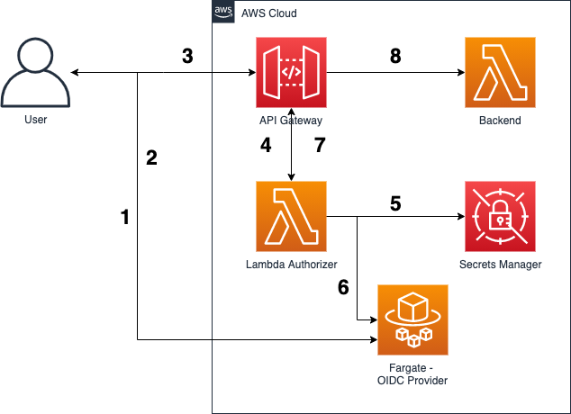

# Open Banking Brazil - Authorization Samples

## Overview

This repo intends to demonstrate how to address the OAuth2-based authorization security requirement for Brazilian Open Banking to use Amazon API Gateway to protect and authorize API accesses using an external [FAPI-compliant OIDC provider](./resources/oidc-provider-app) and a [Lambda Authorizer](./resources/lambda/lambda-auth.js).
*** 

## Prerequisites:

- [awscli](https://docs.aws.amazon.com/cli/latest/userguide/cli-chap-install.html)
- [Pre configured AWS credentials](https://docs.aws.amazon.com/amazonswf/latest/developerguide/RubyFlowOptions.html)
- [npm](https://docs.npmjs.com/downloading-and-installing-node-js-and-npm)
- [cdk](https://docs.aws.amazon.com/cdk/latest/guide/getting_started.html)
- [Docker](https://docs.docker.com/get-docker/)
- [A Route 53 Public Hosted Zone configured to a DNS](https://docs.aws.amazon.com/Route53/latest/DeveloperGuide/dns-configuring.html)
- [A Public Certificate issued to your Domain Name using ACM](https://docs.aws.amazon.com/acm/latest/userguide/gs-acm-request-public.html)

## 1. How to deploy

### 1.1. Creating the Container Image

Make sure Docker is running. We will use Docker to create the container that will be used to run NODE-OIDC, create an Amazon ECR repository, and push our newly create image to our repository. 

After Docker is running, execute the following commands: 

```sh
git clone <REPO_URL>
cd <REPO_NAME>/resources/oidc-provider-app
npm install
aws ecr create-repository --repository-name oidc-provider-app
```

Take note of your `repositoryUrl` output variable, which should be something like this: `repositoryUri": "<AWS_ACCOUNT_ID>.dkr.ecr.<AWS_REGION>.amazonaws.com/oidc-provider-app"`

Now let's build our image and push it to the ECR repository:

```sh
docker build -t oidc-provider-app .
docker tag oidc-provider-app:latest <AWS_ACCOUNT_ID>.dkr.ecr.<AWS_REGION>.amazonaws.com/oidc-provider-app:latest
docker push <AWS_ACCOUNT_ID>.dkr.ecr.<AWS_REGION>.amazonaws.com/oidc-provider-app:latest
```

### 1.2. Configure Environment Variables

Now, make sure to set the following env variables in the `.env` file:

| Key   |      Value      |      Description      |
|----------|:-------------:|-----------------------:|
| ECR_REPOSITORY_ARN | arn:aws:ecr:<region>:<account_id>:repository/oidc-provider-app | Your Amazon ECR repository name for the Node OIDC Provider application |
| ECR_OIDC_IMAGE_TAG | latest | Your Docker image tag (e.g. latest) |
| ACM_CERTIFICATE_ARN |  arn:aws:acm:<region>:<account_id>:certificate/abc-123 | Your Amazon Certificate Manager (ACM) public certificate ARN |
| R53_ZONE_NAME | example.com | Your Route 53 public zone name (e.g. example.com) |
| R53_HOSTED_ZONE_ID | ABCDEF012345 | Your Route 53 public Hosted Zone ID |
| R53_DOMAIN_NAME | oidc.example.com | The desired domain name to host your OIDC application (e.g. oidc.example.com) |
| JWKS_URI | /jwks | Your OIDC Provider's JWKS Endpoint |
| SM_JWKS_SECRET_NAME | dev/OpenBankingBrazil/Auth/OIDC_JWKS | The AWS Secrets Manager's secret name to securely store your JWKS Key ID for JWT token verification |

### 1.3. Deploy the CDK Stack

```sh
cd <REPO_NAME>/resources/lambda
npm install
cd ../..
npm install
cdk deploy
```

This will install all packages required. CDK will then bootstrap a deploy environment in your account. You will then synthetize a cloudformation template and finally deploy it. The end result will be the following architecture performing the following steps: 



1. User accesses the OIDC provider to Authenticate (AuthN) and enter its credentials.
1. OIDC provider issues a JWT-based access and/or ID token to client.
1. User invokes a protected API resource passing the access/ID bearer token to the `Authorization` header.
1. API Gateway uses a Lambda Authorizer to decode and verify the JWT token and its scopes to allow/deny access to the protected resource.
1. Lambda Authorizer query the JWKS key for verifying the token signature stored in AWS Secrets Manager
1. Lambda Authorizer uses the retrieved key from AWS Secrets Manager to verify the token signature against the OIDC provider. 
1. In case the token is successfully verified and contains the proper scopes to access the API resource, Lambda Authorizer returns a temporary IAM credential allowing API Gateway to invoke the protected resource. 
1. API Gateway invokes the protected resource and performs an action on behalf of the user.

## 2. Test Your Application 

### 2.1. Terminal - Invoke your API
First, use terminal to run the following command to invoke your API without any JWT token:

```sh
curl -X GET https://<API-ID>.execute-api.<REGION>.amazonaws.com/prod/
```
You should get the following error message with a `401 HTTP Status Code`:

`"message": "Unauthorized"`

Or the following error message with a `403 HTTP Status Code` in case you pass an invalid `Bearer` token:

`"Message": "User is not authorized to access this resource with an explicit deny"`

### 2.2. Browser - Authenticate against the OIDC provider

Open your browser and open the following URL:

`https://<YOUR-DOMAIN-NAME>/auth?client_id=client_app&redirect_uri=https://jwt.io&response_type=id_token&scope=openid%20profile&nonce=123&state=abca`

You'll be required to enter your username/password. At this time, you can enter any user/pass. Click **Sign-in**.


Now, once presented with the `consent` screen, you can authorize the provider to issue a token on behalf of your user. Click **Continue**.


For validation-only purposes, you are being redirected to JWT.IO to visualize your issue JWT token. **Copy the generated token from the left side of the screen**.


### 2.3. Terminal - Invoke your API passing your JWT as Authorization Header

Let's try once again, this time including the `Authorization` header in our request together with our newly issued JWT token.

```sh
curl -X GET https://<API-ID>.execute-api.<REGION>.amazonaws.com/prod/ -H "Authorization: Bearer <YOUR.ACCESS.TOKEN>"
```

Now, you should get the following message with a `200 HTTP Status Code`:

`Hello From Authorized API`

Congratulations! You have now configured your API Gateway to authorize access based on JWT-based tokens issued by an external FAPI-compliant OIDC Provider.

## 3. Cleaning UP

Run the following command:

```sh
cdk destroy
aws ecr delete-repository --repository-name oidc-provider-app
```

## 4. Security

See [CONTRIBUTING](CONTRIBUTING.md#security-issue-notifications) for more information.

## 5. License

This library is licensed under the MIT-0 License. See the LICENSE file.


